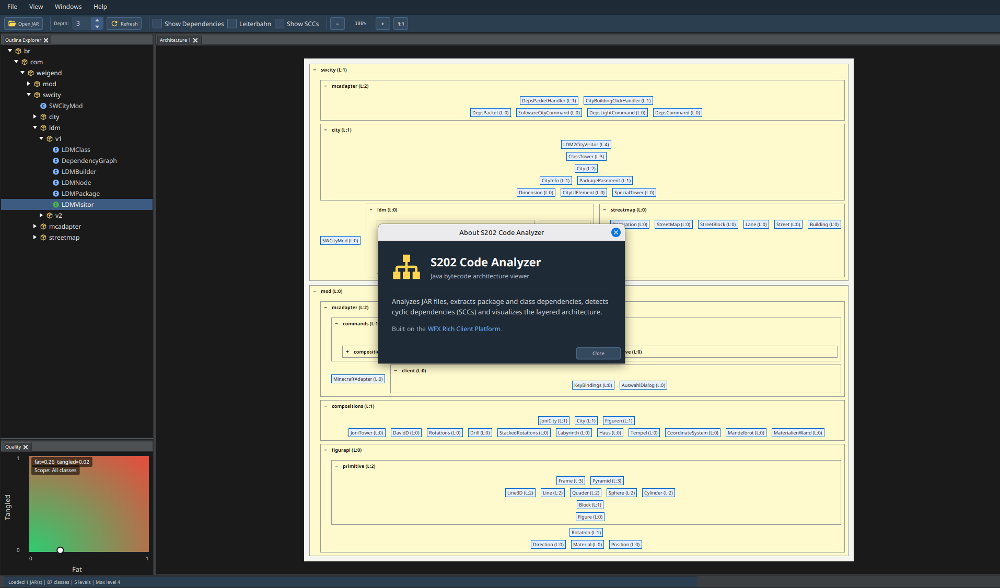

# S202 Code Analyzer

Ein JavaFX-basiertes Tool zur Analyse von Java-Bytecode und Visualisierung der Code-Architektur.



## Features

- **Bytecode-Analyse**: Parst Java `.class`-Dateien mit ASM 9.6
- **Abhängigkeitserkennung**: Extrahiert Klassen- und Paket-Abhängigkeiten
- **Zykluserkennung**: Findet zyklische Abhängigkeiten (Strongly Connected Components)
- **Architektur-Layering**: Topologische Sortierung nach Abhängigkeitstiefe
- **Hierarchische Visualisierung**: JavaFX TreeView mit aufklappbaren Paketen
- **Violation-Erkennung**: Markiert architektonische Verletzungen (Rückwärts-Abhängigkeiten)
- **Multi-Projekt-Import**: Maven (`pom.xml`) und Gradle (`settings.gradle`) Multi-Modul-Projekte direkt einlesen — alle Modul-JARs werden automatisch eingesammelt
- **Layout-Invariant-Check**: Verifiziert nach jeder Analyse die Level-Pipeline (R1/R2/R3/R5) und meldet Algorithmus-Bugs mit kopierbarem Reproducer-Block

## Schnellstart

```bash
# Build
mvn clean install

# Anwendung starten
mvn javafx:run

# Tests ausführen
mvn test
```

Dann im **File**-Menü:

- **Open JAR…** — eine oder mehrere JARs (Mehrfachauswahl öffnet einen Staging-Dialog)
- **Open Maven Project…** — auf das Wurzel-`pom.xml` zeigen, alle Modul-JARs aus `target/` werden gesammelt
- **Open Gradle Project…** — auf `settings.gradle(.kts)` oder `build.gradle(.kts)` zeigen, alle Modul-JARs aus `build/libs/` werden gesammelt

→ Architektur wird analysiert, visualisiert und automatisch gegen vier Layout-Invarianten geprüft.

## Systemanforderungen

- **Java 21+**
- **Maven 3.9+**
- **JavaFX 21.0.1** (wird automatisch via Maven geladen)

## Projektstruktur

```
analyzer/src/main/java/de/weigend/s202/
├── analysis/       # Algorithmen (SCC, Level-Strategien)
├── domain/         # Kernmodelle (DomainModel, LevelCalculator)
├── reader/         # JAR-Loading, Dependency-Extraktion
└── ui/             # JavaFX-Oberfläche
```

## Verwendung

1. **Code laden**: Über `File → Open JAR…` einzelne JARs, `Open Maven Project…` oder `Open Gradle Project…` ganze Multi-Modul-Bauten
2. **Analyse**: Pakete und Klassen werden automatisch analysiert; ein Layout-Invariant-Check verifiziert die Level-Pipeline
3. **Navigation**: Pakete auf-/zuklappen, Abhängigkeiten einsehen
4. **Violations**: Rote gestrichelte Linien zeigen architektonische Probleme; bei Pipeline-Bugs öffnet sich ein Reproducer-Dialog mit Copy-Button

## VS Code Integration

```bash
code .
# Ctrl+Shift+P → "Maven: Run from Terminal" → javafx:run
```

Details: [docs/VS_CODE_SETUP.md](docs/VS_CODE_SETUP.md)

## Dokumentation

- [QUICKSTART.md](QUICKSTART.md) - Schneller Einstieg
- [docs/](docs/) - Weitere technische Dokumentation
