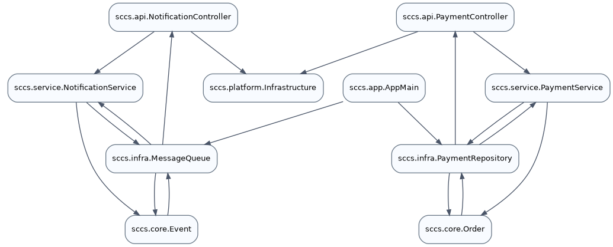
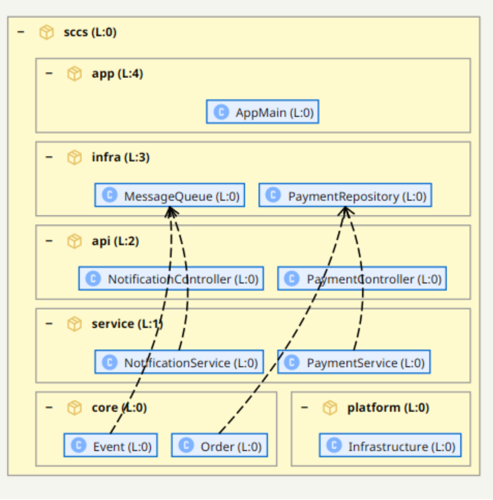

# Software-Architektur als Schichtendarstellung
*Analyse der Software-Architektur mit S202*

Johannes Weigend
Entwurf, 24. Mai 2026

## Einleitung

Software-Architektur wird seit langem als geschichtete Abhängigkeitsstruktur dargestellt. Die Grundidee ist einfach: Ein Element, das ein anderes Element benutzt, steht oberhalb des benutzten Elements. Abhängigkeiten laufen damit von oben nach unten. Kanten in Gegenrichtung sind auffällig, weil sie häufig auf Zyklen, unerwünschte Kopplung oder eine gebrochene Schichtenordnung hinweisen.

Solche vertikal ausgerichteten Graphen helfen, Abhängigkeiten in einem System sichtbar zu machen. Ein einfaches Beispiel liefern die Werkzeuge `jdeps` und `dot`: `jdeps` extrahiert die Klassenabhängigkeiten aus einem Jar, `dot` erzeugt daraus einen gerichteten Graphen. Abbildung 1 zeigt zunächst nur den azyklischen Teil des Example-Jars.


*Abbildung 1: Azyklischer Ausschnitt aus `test-example-1.0.0.jar`. Die Pfeile zeigen von der nutzenden Klasse zur genutzten Klasse; die horizontalen Linien markieren die berechneten Levels.*

Die Pfeile zwischen den Boxen sind Abhängigkeiten von Klassen durch Aufruf oder Nutzung. Im Beispiel nutzt `com.example.B` die Klasse `com.example.A`, kurz `B -> A`. Die horizontalen Linien sind manuell ergänzt und visualisieren die Ebenen der Schichtung. Level 0 bildet das Fundament; höhere Levels stehen für Elemente, die von darunterliegenden Elementen abhängen.

Diese Art der Darstellung ist nützlich und weit verbreitet. Als Visualisierung realer Anwendungen hat sie aber drei praktische Probleme:

1. Viele Pfeile machen die Grafik schon bei mittelgroßen Anwendungen unübersichtlich.
2. Die Paketstruktur ist über mehrere Levels verteilt und bildet keine sichtbare Gruppierung.
3. Bei zyklischen Abhängigkeiten muss der Zyklus für die Levelberechnung aufgebrochen werden, damit überhaupt eine vertikale Ordnung entsteht. Der ursprüngliche Abhängigkeitsgraph bleibt unverändert; verändert wird der daraus abgeleitete DAG, auf dem die Levels berechnet werden. Entscheidend ist deshalb, welche Kante in diesem Berechnungsgraphen gesondert behandelt wird.

## S202 als hierarchische Schichtendarstellung

Mit dem Open-Source-Werkzeug S202 versuchen wir, diese Probleme gezielt zu adressieren. S202 ersetzt den flachen Klassengraphen nicht einfach durch eine hübschere Darstellung, sondern durch eine hierarchische Architekturhypothese: Pakete bleiben als Container sichtbar, und innerhalb jedes Containers werden Pakete oder Klassen nach ihren Abhängigkeiten angeordnet.

Die Pfeile können optional eingeblendet werden. Im Normalfall soll die vertikale Ordnung aber bereits ohne Pfeile verständlich machen, welche Teile der Anwendung weiter oben liegen und welche als Fundament dienen. Unerwünschte Dependencies fallen dadurch nicht als einzelne Linie in einem großen Netz auf, sondern als Bruch in einer erwarteten Schichtenordnung.

Im Gegensatz zum flachen Klassengraphen sind die Levels bei S202 hierarchisch durch die Paketstruktur gegliedert. Jedes Paket ordnet seine direkten Kinder, also Subpakete oder Klassen, nach deren lokalen Abhängigkeiten. Die Paketstruktur bleibt dadurch sichtbar, statt im Klassengraphen auseinandergezogen zu werden.


*Abbildung 2: S202-Darstellung des azyklischen Beispielausschnitts: Pakete bleiben als Container sichtbar, Klassen werden innerhalb ihres Containers geordnet, und Pfeile können bei Bedarf eingeblendet werden.*

Das Beispiel zeigt die innere Klassenhierarchie im Paket `example2` und zugleich die übergreifende Struktur: `example2` hängt von `example` und `example1` ab. Auf Klassenebene gilt für `example2`: `E -> A -> (B | C) -> D`. Die Darstellung abstrahiert dabei bewusst von einzelnen Kanten. Ob `A` eine Abhängigkeit nach `B`, nach `C` oder nach beiden hat, ist für die grobe Architekturansicht weniger wichtig als die Schichtung des Pakets. Genau diese Abstraktion macht umfangreiche Beziehungsnetze noch lesbar.

Die Idee ist nicht neu. Das kommerzielle Produkt Structure101 hatte bereits eine sehr ähnliche Darstellung. Es gibt jedoch keine offene Implementierung und keine technische Dokumentation, die erklärt, wie man ein solches Layout zuverlässig berechnet. S202 schließt diese Lücke als Open-Source-Werkzeug unter der Apache-Lizenz.

Dieses Dokument beschreibt die typischen Fallstricke bei der Realisierung eines solchen Layouts und zeigt eine Lösung, mit der sich viele dieser Probleme konzeptionell sauber eliminieren lassen.

## Typische Fehler bei der Berechnung von Schichten

Die Abbildungen 1 und 2 zeigen bewusst einen einfachen, azyklischen Ausschnitt des Example-Jars. Für diesen Fall ist die Schichtung eindeutig: `E` steht über `A`, `A` steht über `B` und `C`, und beide stehen über `D`. Es gibt keine Rückkopplung, deshalb muss keine Kante ausgewählt werden, die für die Levelberechnung ignoriert wird.

In realen Anwendungen ist dieser Fall eher die Ausnahme. Sobald Klassen oder Pakete zyklisch voneinander abhängen, reicht ein normaler Durchlauf über den Graphen nicht mehr aus. Genau dort beginnen die interessanten Fehler: Die Darstellung sieht oft noch plausibel aus, aber die berechneten Ebenen sind nicht mehr stabil oder nicht mehr fachlich erklärbar.

Ein korrektes Schichtlayout muss gleichzeitig mehrere Aussagen erfüllen:

1. Wenn `A -> B` gilt, muss `A` oberhalb von `B` stehen.
2. Pakete müssen als Container sichtbar bleiben. Ein Paket darf nicht zufällig verschoben werden, nur weil eine einzelne enthaltene Klasse ein hohes Klassenlevel hat.
3. Klassen oder Pakete, die eine SCC bilden, müssen explizit behandelt werden, weil in einem Zyklus nicht alle Kanten gleichzeitig nach unten laufen können.

Diese Regeln sind einzeln gut lösbar. Zusammen erzeugen sie aber ein zirkuläres Abhängigkeitssystem zwischen den Ebenen der Berechnung selbst: Klassenlevel beeinflussen sichtbare Positionen, Paketcontainer strukturieren diese Positionen, und SCCs erzwingen Korrekturen an einer Ordnung, die man ohne Zyklusbehandlung schon berechnet hätte. Genau daraus entstehen die typischen Fehlermodi.

### Fehlermodi

### Retroaktive Korrektur

Ein naiver Algorithmus läuft über die Klassen und vergibt direkt Level. Er sieht zuerst Klasse `A`, setzt ihr Level und hebt damit auch das Paket von `A` an. Später findet er Klasse `B` und erkennt: `A` und `B` gehören zu derselben SCC und müssen gemeinsam behandelt werden. Jetzt müsste `A` korrigiert werden, und damit auch ihr Paket und möglicherweise weitere Pakete, die davon abhängen.

Das Problem ist nicht die Korrektur selbst. Das Problem ist, dass Teile des Layouts zu diesem Zeitpunkt bereits als fertig behandelt wurden. Ein Algorithmus, der Zyklenerkennung und Levelvergabe vermischt, muss rückwirkend an Stellen ändern, die er eigentlich schon verlassen hat.

### Reihenfolgeabhängige Ergebnisse

Klassen kommen aus Jars. Die Reihenfolge, in der ein Tool Klassen sieht, folgt nicht der Architektur, sondern der Packreihenfolge des Jars, der Modulreihenfolge, dem Build-Tool oder Details des Dateisystems. Wenn ein Algorithmus Zyklen während dieser Traversierung nebenbei behandelt, hängt das Ergebnis von dieser zufälligen Reihenfolge ab.

Das ist gefährlich, weil der Fehler nicht sofort sichtbar sein muss. Die Grafik kann weiterhin ungefähr richtig aussehen. Trotzdem kann dieselbe Codebasis je nach Build-Konfiguration andere Level bekommen.

### Vermischte Klassen- und Paketlevel

Ein naheliegender Fehler ist, das Level eines Pakets aus dem höchsten Level seiner enthaltenen Klassen abzuleiten. Das klingt plausibel, vermischt aber zwei verschiedene Fragen: Wo liegt eine Klasse im Klassengraphen, und wo liegt ein Paket in der Architekturhypothese?

Ein Paket ist nicht deshalb architektonisch hoch, weil es zufällig eine hoch eingeordnete Klasse enthält. Die zentrale Regel lautet:

> Paketlevel entstehen aus Paketabhängigkeiten, nicht aus der maximalen Höhe einzelner Klassen.

Das klingt trivial, ist es aber nicht. Gerade weil Pakete Container für Klassen sind, liegt es nahe, ihre Position aus den enthaltenen Klassen abzuleiten. Genau dadurch vermischt man jedoch zwei Ebenen, die getrennt bleiben müssen. Erst wenn Paketlevel aus Paketabhängigkeiten entstehen, bleiben Pakete stabile architektonische Einheiten. Sonst kann eine einzelne Klasse die sichtbare Paketordnung verschieben und damit den Container genau in dem Moment entwerten, in dem er Orientierung geben soll.

### Der große See

Die formal saubere Antwort auf Zyklen lautet: Alle Elemente einer SCC bekommen dasselbe Level. Für kleine Zyklen ist das akzeptabel. In realen Systemen können SCCs aber sehr groß werden. Dann landen hunderte oder tausende Klassen auf derselben Ebene. Die Schichtung verschwindet; übrig bleibt ein flacher Block.

Damit wird der Zyklus zwar korrekt erkannt, aber nicht mehr brauchbar visualisiert. Ein Werkzeug muss große SCCs daher aufbrechen können. Entscheidend ist, dass die geschnittenen Kanten nicht verschwinden. Sie müssen sichtbar bleiben, weil genau sie erklären, warum die berechnete Ordnung nur als Architekturhypothese gilt.

## Die Lösung

Die Lösung besteht darin, Analyse, Ordnungsbildung und Darstellung konsequent zu trennen. Der Klassengraph bleibt das Rohmodell der tatsächlichen Abhängigkeiten. Er wird nicht verändert, nur weil für eine Schichtendarstellung ein DAG benötigt wird. Stattdessen erzeugt S202 aus diesem Graphen zusätzliche Sichten: SCCs für die Zyklenerkennung, einen gewichteten Paketgraphen für die Architekturhypothese und eine hierarchische UI-Struktur für die Darstellung.

Mit Architekturhypothese ist dabei keine behauptete Soll-Architektur gemeint. Gemeint ist eine aus den beobachteten Abhängigkeiten abgeleitete Ist-Architektur: die Ordnung, die dem vorhandenen Code und seinen Abhängigkeiten am engsten entspricht, ohne zu verschweigen, wo diese Ordnung durch Zyklen oder Rückkanten gebrochen wird.

Die Paketordnung bildet dabei das zentrale Bindeglied. Sie wird nicht aus den höchsten Klassenlevels abgeleitet, sondern aus den aggregierten Paketabhängigkeiten. Diese Trennung ist der entscheidende Schritt: Klassen werden innerhalb ihrer Pakete geordnet, Pakete dagegen nach ihren eigenen Paketbeziehungen. Dadurch kann ein Paket als Container stabil bleiben, auch wenn einzelne Klassen darin hoch oder niedrig liegen. Gleichzeitig liefert die Paketordnung ein Kriterium, um Back-Edges nicht beliebig auszuwählen, sondern als Kanten gegen die erwartete Ordnung zu erklären.

Damit verschwinden die oben beschriebenen Fehlermodi nicht durch einen einzelnen Algorithmustrick, sondern durch eine klare Zuständigkeit der Berechnungsschritte: Erst werden Abhängigkeiten analysiert, dann wird eine plausible Ordnung bestimmt, danach wird die sichtbare Struktur aufgebaut, und zuletzt wird geprüft, ob die Darstellung ihre eigene Aussage einhält. Die folgenden Abschnitte beschreiben diese Lösung im Detail.

## Von Klassenabhängigkeiten zur Paketordnung

Der flache Klassengraph ist in S202 nicht das sichtbare Layoutmodell. Er ist ein Analyseartefakt: Er dient dazu, konkrete Abhängigkeiten zu erfassen, SCCs zu erkennen, globale Klassenlevel zu berechnen und Klassenabhängigkeiten zu Paketbeziehungen zu aggregieren. Die sichtbare S202-Grafik entsteht danach aus der Paketstruktur und der lokalen Ordnung innerhalb der Paketcontainer.

S202 führt dieses fehlende Kriterium über die Paketordnung ein. Dafür werden die Klassenabhängigkeiten zunächst zu Paketabhängigkeiten aggregiert: Wenn Klassen aus Paket `P` Klassen aus Paket `Q` benutzen, entsteht eine gewichtete Kante `P -> Q`. Das Gewicht ist die Anzahl der aggregierten Nutzungen; für strukturelle Abhängigkeiten ohne Aufrufzählung wird ein Gewicht von 1 verwendet. Die Gegenrichtung wird ebenfalls gezählt.

Aus diesen Gewichten berechnet S202 für Pakete ein Rangmaß:

```text
rank(P) = (out(P) - in(P)) / max(1, out(P) + in(P))
```

`out(P)` ist die Summe der gewichteten Kanten von `P` zu anderen betrachteten Paketen, `in(P)` die Summe der gewichteten Kanten aus diesen Paketen nach `P`. Ein positiver Rang bedeutet: Das Paket benutzt mehr, als es selbst benutzt wird; es gehört tendenziell nach oben. Ein negativer Rang bedeutet: Das Paket wird eher benutzt und gehört tendenziell nach unten. Das Rangmaß liefert damit eine Oben/Unten-Einschätzung für die Pakete im betrachteten Paketgraphen. So kann etwa ein allgemeines Wurzelpaket unterhalb der konkreteren nutzenden Pakete liegen.

Eine Ordnungsentscheidung entsteht erst, wenn der Rangunterschied größer als eine Schwelle `epsilon` ist. In S202 wird dafür aktuell `epsilon = 0.1` verwendet. Liegen zwei Pakete zu nah beieinander, bleiben sie konzeptionell Peers und damit auf demselben Level. Ein gegenseitiges Aufrufverhältnis von `100 : 101` ist deshalb keine belastbare Architekturentscheidung.

## Vom Klassenzyklus zur Paketordnung

Abbildung 3 zeigt den zyklischen Teil des Example-Jars als klassischen Klassengraphen. Die beiden Teilgraphen für Notification und Payment enthalten jeweils Rückkopplungen. Damit ist klar, dass der Graph nicht mehr vollständig als einfache Schichtung dargestellt werden kann: In einem Zyklus kann nicht jede Kante gleichzeitig von einem höheren zu einem niedrigeren Level laufen.



*Abbildung 3: Zyklischer Ausschnitt aus `test-example-1.0.0.jar`. In jedem Zyklus muss mindestens eine Kante für die Levelberechnung geschnitten werden.*

Der wichtige Begriff dafür ist SCC, kurz für *Strongly Connected Component*. Eine SCC ist eine Menge von Klassen, in der jede Klasse jede andere Klasse über gerichtete Abhängigkeitspfade erreichen kann. Das etablierte Verfahren zur Ermittlung solcher Komponenten ist der Tarjan-Algorithmus. Die markierten zyklischen Bereiche bilden zwei nicht-triviale SCCs: eine Notification-SCC mit `NotificationController`, `NotificationService`, `MessageQueue` und `Event`, sowie eine Payment-SCC mit `PaymentController`, `PaymentService`, `PaymentRepository` und `Order`. Innerhalb dieser SCCs gibt es mehrere einzelne Zykluspfade, aber für die Levelberechnung wird jede SCC zunächst als zusammenhängende Einheit behandelt.

Damit stellt der Klassengraph im Zyklusfall die technische Frage: Welche Kante muss man ignorieren, damit aus der SCC wieder ein berechenbarer DAG für die Levelbildung wird? Der Klassengraph allein liefert dafür aber kein fachliches Kriterium. Er zeigt Klassen und Abhängigkeiten, aber keine Paketordnung und keine Architekturabsicht.

Erst vor diesem Hintergrund werden Rückkopplungen interpretiert. Eine sichtbare Back-Edge ist dann keine beliebige Schnittkante im flachen Klassengraphen, sondern eine konkrete Abhängigkeit, die gegen die berechnete Paketordnung läuft und deshalb die Architekturhypothese erklärt.



*Abbildung 4: Zyklischer S202-Ausschnitt. Die gestrichelten Kanten sind Back-Edges: Sie laufen gegen die aus den Paketabhängigkeiten abgeleitete Ordnung und bleiben als sichtbarer Befund der Architekturhypothese erhalten.*

Der Unterschied zwischen Back-Edge und Verletzung ist wichtig. Eine Back-Edge gehört zur Zyklusbehandlung: Sie ist eine Kante, die innerhalb einer SCC gegen die angenommene Ordnung läuft und für die Berechnung der Ordnung nicht wie eine normale Abhängigkeit behandelt werden kann. Eine Verletzung dagegen ist allgemeiner: Sie ist eine konkrete Abhängigkeit, die nach der berechneten Ordnung nach oben läuft. Eine solche Verletzung kann auch außerhalb eines zyklischen Klassengraphen auftreten, zum Beispiel wenn eine Klasse in einem tieferen Paket eine Klasse in einem höheren Paket benutzt, ohne dass dadurch ein Klassenzyklus entsteht.

S202 versteckt den Zyklus daher nicht. Die Back-Edge bleibt sichtbar, weil sie erklärt, warum die Paketordnung nicht vollständig zu den konkreten Klassenabhängigkeiten passt. Dadurch wird die Abweichung nachvollziehbar statt beliebig.

## Redundante Prüfung der Konsistenz

Die bisher beschriebenen Schritte zeigen bereits, warum die Umsetzung fehleranfällig ist. Es reicht nicht, einzelne Algorithmen isoliert mit Unit Tests abzusichern. Viele Fehler entstehen erst durch das Zusammenspiel der Daten: konkrete Klassenabhängigkeiten, Paketstruktur, SCCs, aggregierte Paketgewichte und lokale UI-Positionen beeinflussen sich gegenseitig. Ein Testprojekt kann sauber aussehen, während ein anderes Jar durch eine ungünstige Kombination von Zyklen und Paketbeziehungen eine falsche Darstellung erzeugt.

S202 prüft deshalb nicht nur einzelne Rechenschritte. Nachdem die komplette Pipeline gelaufen ist, wird das fertige Ergebnis redundant gegen Konsistenzregeln geprüft. Diese Regeln berechnen das Layout nicht neu und korrigieren auch nichts. Sie lesen nur das Ergebnis und fragen: Ist die erzeugte Darstellung in sich stimmig?

Die Prüfung betrachtet drei Ebenen:

1. **Klassengraph:** Für normale Klassenabhängigkeiten muss gelten: Wenn `A -> B`, dann steht `A` auf einem höheren Level als `B`. Ausnahmen müssen explizit klassifiziert sein, zum Beispiel als Back-Edge oder als Kante innerhalb einer SCC.
2. **Paketgraph:** Die berechnete Paketordnung muss zu den gewichteten Paketabhängigkeiten passen. Pakete mit höherem Rang müssen oberhalb der Pakete liegen, von denen sie stärker abhängen. Kanten, die beim Aufbrechen einer Paket-SCC geschnitten werden, dürfen in dieser Prüfung nicht wie normale dominante Kanten behandelt werden; sie müssen gesondert als Paket-Back-Edges klassifiziert sein.
3. **UI-Darstellung:** Die sichtbare Anordnung muss zum berechneten Modell passen. Paketcontainer, lokale Klassenpositionen und verschachtelte Levels dürfen die berechnete Architekturhypothese nicht stillschweigend umkehren.

Diese Konsistenzregeln sind keine zusätzliche Optimierung und kein zweiter Layoutalgorithmus. Sie sind ein unabhängiger Plausibilitätscheck nach Abschluss der Berechnung. Genau dadurch finden sie Fehler, die in normalen Unit Tests leicht fehlen: ein Paketlevel wurde korrekt berechnet, aber lokal falsch dargestellt; eine Back-Edge wurde geschnitten, aber nicht als solche markiert; eine normale Kante läuft nach oben, ohne dass sie Teil einer SCC ist.

Der entscheidende Punkt ist Redundanz. Die Pipeline erzeugt die Darstellung. Die Regeln prüfen anschließend, ob diese Darstellung ihre eigene Aussage einhält. Damit wird aus einer hübschen Grafik ein überprüfbares Modell.

## Von der Visualisierung zur Aktion

Eine berechnete Architekturhypothese ist besonders dann nützlich, wenn sie nicht nur einen Zustand beschreibt, sondern Veränderung planbar macht. S202 enthält dafür eine What-If-Analyse: Klassen und Pakete können per Drag and Drop in der Darstellung verschoben werden. Das Modell wird dadurch nicht sofort refaktoriert; stattdessen berechnet das Werkzeug, welche Abhängigkeiten in der neuen Anordnung nach oben laufen würden.

Die Verletzungen aktualisieren sich nach jeder Verschiebung. Dadurch wird sichtbar, ob eine geplante Umordnung die Architektur konsistenter macht oder neue Probleme erzeugt. Das ist vor allem in Situationen wichtig, in denen das Werkzeug keine eindeutige Ordnung mehr findet: große SCCs, symmetrische Paketabhängigkeiten oder historisch gewachsene Kopplungen lassen sich nicht immer automatisch sinnvoll auflösen.

Ergänzend dazu gibt es eine manuelle CUT-Logik. Back-Edges können gezielt als geplante Schnitte markiert werden, und das Werkzeug kann anschließend prüfen, ob diese Schnitte die betroffene SCC tatsächlich auflösen. Das ist ein wichtiger Unterschied zur bloßen Visualisierung einer problematischen Kante: Der Benutzer sieht nicht nur, welche Kante als Bruch der Ordnung plausibel wäre, sondern kann die Wirkung dieses Schnitts auf den Zyklus überprüfen.

Diese CUT-Logik arbeitet feiner als die sichtbare Klassen- oder Paketkante. Geschnitten wird auf Methodenaufrufebene: Nicht zwingend die gesamte Beziehung zwischen zwei Klassen verschwindet, sondern der konkrete Methodenaufruf, der die zyklische Abhängigkeit verursacht. Dadurch passt das Feature besser zur praktischen Refactoring-Arbeit, weil ein Zyklus oft durch wenige konkrete Aufrufe entsteht, nicht durch die komplette fachliche Beziehung zweier Klassen.

In solchen Fällen liefert S202 nicht einfach eine fertige Antwort. Die What-If-Analyse macht die Konsequenzen möglicher Entscheidungen sichtbar. Ein Entwickler kann ausprobieren, welche Pakete oder Klassen zusammengehören, welche Verschiebungen Verletzungen reduzieren und welche Abhängigkeiten vor einem Refactoring zuerst entfernt werden müssten. Damit wird die Schichtendarstellung zu einem Arbeitswerkzeug für Refactoring-Planung, nicht nur zu einer nachträglichen Visualisierung.

## Umsetzung auf konzeptioneller Ebene

Die Umsetzung trennt die Berechnung bewusst in mehrere Phasen. Entscheidend ist, dass keine Phase eine sichtbare Position festlegt, bevor die Informationen vorliegen, die diese Position begründen. Der Klassengraph, der Paketgraph und die UI-Darstellung sind deshalb keine drei Varianten derselben Datenstruktur, sondern aufeinander aufbauende Sichten.

1. **Klassengraph aufbauen:** Aus dem Bytecode wird ein gerichteter Klassengraph erzeugt. Die Knoten sind Klassen, die Kanten sind konkrete Nutzungen zwischen Klassen. Dieser Graph bleibt das fachliche Rohmodell der Analyse.

2. **SCCs erkennen:** Auf dem Klassengraphen werden stark zusammenhängende Komponenten ermittelt. Das etablierte Verfahren dafür ist Tarjan. Das Ergebnis dieser Phase ist noch kein Layout, sondern die Information, welche Klassen azyklisch einordenbar sind und welche Klassen zu Zyklen gehören.

3. **Paketgraph ableiten:** Aus den Klassenabhängigkeiten werden Paketabhängigkeiten aggregiert. Eine Paketkante `P -> Q` entsteht, wenn Klassen aus `P` Klassen aus `Q` benutzen. Die Kanten werden gewichtet, damit häufige oder dominante Nutzungen stärker zählen als einzelne technische Referenzen.

4. **Paketordnung berechnen:** Aus den gewichteten Ein- und Ausgängen wird für Pakete das Rangmaß `rank(P)` berechnet. Daraus entsteht die vertikale Paketordnung: stärker nutzende Pakete liegen tendenziell oben, stärker genutzte Pakete unten. Kleine Rangunterschiede werden als Peer-Beziehung behandelt.

5. **Back-Edges bestimmen:** Wenn der Paket- oder Klassengraph zyklisch ist, wird dieselbe Ordnung verwendet, um Rückkopplungen zu interpretieren. Kanten, die gegen die dominante Richtung laufen, werden für die Levelberechnung gesondert behandelt. "Geschnitten" bedeutet dabei nicht, dass die Kante aus dem Modell verschwindet. Sie wird nur für den DAG der Levelberechnung ausgenommen und bleibt als Befund erhalten.

6. **Lokale Schichtung aufbauen:** Erst danach wird die sichtbare Baumstruktur erzeugt. Pakete werden als Container dargestellt. Innerhalb jedes Containers werden nur die direkten Kinder angeordnet: Subpakete oder Klassen. Dadurch wird die globale Paketordnung nicht mit lokalen Klassenlevels vermischt. Eine Klasse kann innerhalb ihres Pakets hoch liegen, ohne dadurch automatisch das Paket selbst nach oben zu ziehen.

7. **Konsistenz prüfen und Befunde projizieren:** Zum Schluss werden die berechneten Informationen auf die fertige Darstellung projiziert und redundant geprüft. Normale Dependencies zeigen konkrete Nutzung. SCCs zeigen zyklisch zusammenhängende Elemente. Back-Edges erklären, welche Kanten zur Bildung der Ordnung gesondert behandelt wurden. Violations zeigen Abhängigkeiten, die in der fertigen Darstellung nach oben laufen. Diese Unterscheidung ist wichtig, weil eine Linie sonst ihre Bedeutung verliert: Man sähe zwar eine Kante, aber nicht mehr, ob sie normale Nutzung, Zyklusbefund, Schnittkante oder Verletzung der angezeigten Ordnung ist.

Kurz gefasst:

```text
Bytecode -> Klassengraph -> SCCs -> Paketgraph -> Paketordnung
         -> Back-Edges -> UI-Schichtung -> Konsistenzregeln
```

## Fazit

S202 berechnet nicht die eine wahre Architektur eines Systems. Das wäre aus Bytecode allein auch nicht möglich. S202 erzeugt eine überprüfbare Architekturhypothese: Klassenabhängigkeiten liefern den Graphen, Paketabhängigkeiten liefern eine plausible Ordnung, Back-Edges machen notwendige Brüche sichtbar, und Konsistenzregeln prüfen, ob die fertige Darstellung ihre eigene Aussage einhält.

Der wichtigste Beitrag liegt deshalb nicht in einer schöneren Grafik, sondern in der Verbindung von Darstellung, Erklärung und Veränderbarkeit. Die Schichtung zeigt eine mögliche Ordnung. Die markierten Befunde erklären, wo diese Ordnung durch konkrete Abhängigkeiten gebrochen wird. What-If-Verschiebungen und manuelle CUTs machen sichtbar, welche Refactorings diese Brüche reduzieren oder Zyklen tatsächlich auflösen können.

Damit ist die Visualisierung mehr als ein Layout. Sie ist ein erklärbares Arbeitsmodell: Jede Position und jede hervorgehobene Kante muss auf eine nachvollziehbare Entscheidung in der Berechnung zurückführbar sein, und jede geplante Änderung kann gegen dieselbe Ordnung geprüft werden.
