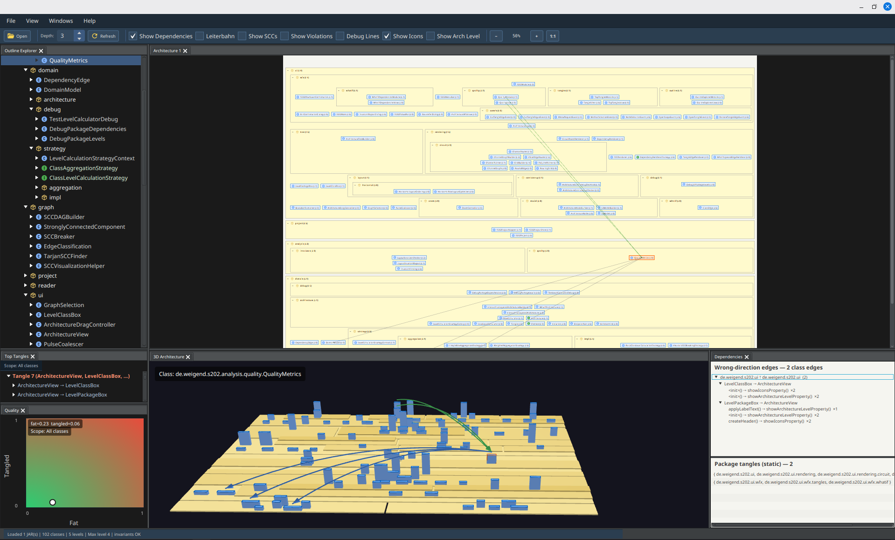
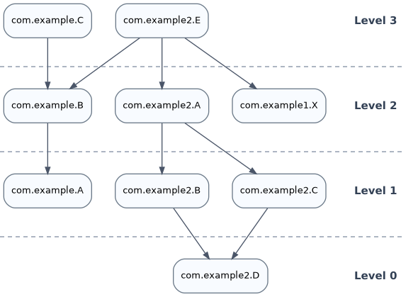
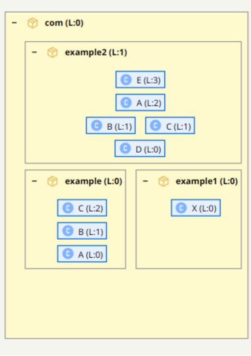
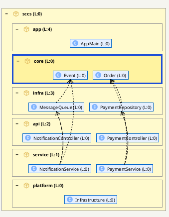

# Wer räumt nach der KI auf?
*Software-Architektur als Arbeitsmodell für generierte Java-Systeme*

Johannes Weigend



## Zusammenfassung

KI-Assistenten wie Codex, Claude Code, GitHub Copilot oder JetBrains AI Assistant beschleunigen die Softwareentwicklung massiv. Damit entsteht nicht nur schneller Code, sondern auch schneller Architektur. Dieser Artikel diskutiert, warum Architekturarbeit dadurch nicht verschwindet, sondern dringender wird: Menschen müssen weiterhin verstehen, verantworten und korrigieren, was im System strukturell entsteht. Am Beispiel des Open-Source-Werkzeugs S202 wird gezeigt, wie sich Java-Bytecode in eine prüfbare Architekturhypothese überführen lässt. Die Darstellung macht Paketstruktur, Schichtung, Zyklen, Back-Edges und Verletzungen sichtbar und unterstützt What-If-Analysen für Refactorings. Der Beitrag richtet sich an Java-Teams, Architekten und Studierende, die KI-generierten oder KI-unterstützt veränderten Code bewerten wollen.

## Wenn Code schneller entsteht als Verständnis

Softwareentwicklung hat eine neue Geschwindigkeit erreicht. Ein Entwickler kann heute mit einem KI-Assistenten in wenigen Minuten ein lauffähiges Feature, eine REST-Schnittstelle, ein Datenmodell, Tests und Build-Konfiguration erzeugen lassen. Was früher Tage dauerte, entsteht nun in einem Dialog. Das ist ein echter Fortschritt: Boilerplate verschwindet, Experimente werden billiger, und viele klassische Anfängerfehler treten seltener auf.

Die Kehrseite ist weniger spektakulär, aber architektonisch wichtiger. Wenn Code schneller entsteht, entstehen auch technische Schulden schneller. KI-Assistenten bauen geduldig ein Feature nach dem anderen ein. Sie murren nicht, wenn eine Klasse weiter wächst, wenn ein Service noch eine Verantwortung bekommt oder wenn eine Abhängigkeit in die falsche Richtung zeigt. Sie können in einem großen Kontext erstaunlich lange den lokalen Überblick behalten. Genau das verschiebt den Moment, in dem ein menschliches Team normalerweise sagt: Stop, wir brauchen eine Architekturentscheidung.

Damit ist KI-generierter Code nicht automatisch schlechter als handgeschriebener Code. Oft ist er lokal sogar sauber: Namen sind plausibel, Tests existieren, Framework-Konventionen werden eingehalten. Das Problem liegt eine Ebene höher. Architektur ist keine lokale Eigenschaft. Sie entsteht aus Abhängigkeiten, Verantwortlichkeiten, Grenzen und der Frage, welche Teile eines Systems andere Teile kennen dürfen. Diese Struktur wird bei iterativer Entwicklung leicht unscharf, egal ob der Code von Menschen, von KI-Assistenten oder von beiden gemeinsam geschrieben wurde.

Die zentrale Frage für die Developer Experience ist deshalb nicht nur: Wie schnell kann ich Code erzeugen? Sondern auch: Wie schnell kann ich verstehen, was ich erzeugt habe?

## Architektur bleibt menschliche Verantwortung

KI kann Refactorings erstaunlich schnell ausführen. Sie kann Klassen aufteilen, Tests anpassen, Methoden verschieben, Abhängigkeiten durch Interfaces ersetzen oder ein Modul in ein anderes Build-Artefakt auslagern. Aber sie entscheidet nicht zuverlässig, welche Struktur für ein Produkt langfristig tragfähig ist. Diese Entscheidung hängt an Domänenwissen, Teamorganisation, Release-Prozessen, Sicherheitsanforderungen und an Erwartungen, die nicht vollständig im Code stehen.

Deshalb verschiebt KI die Rolle von Entwicklerinnen und Entwicklern. Ein Teil der Arbeit wandert vom Tippen zum Steuern, Prüfen und Entscheiden. Menschen brauchen dafür Werkzeuge, die nicht nur einzelne Codezeilen bewerten, sondern die Struktur eines Systems lesbar machen. Ein Pull Request mit 4.000 Zeilen KI-generiertem Code ist für ein klassisches Review kaum noch sinnvoll erfassbar, wenn das Review nur Datei für Datei betrachtet. Interessant sind Fragen wie:

- Welche neuen Abhängigkeiten und Komponenten sind entstanden, und wie wurden sie integriert?
- Was wurde entkoppelt, was zusammengeführt?
- Gibt es Zyklen zwischen Paketen — und welche Schnitte würden sie auflösen?
- Welche Klassen wurden falsch platziert?

Solche Fragen sind nicht neu. Sie werden durch KI nur dringlicher, weil die Menge und Geschwindigkeit der Änderungen steigt.

## Von Dateien zu Abhängigkeiten

Ein Java-Projekt sieht auf der Platte zunächst geordnet aus. Es gibt Packages, Maven-Module, Gradle-Projekte, Verzeichnisse und JAR-Dateien. Diese physische Ordnung hilft beim Finden von Dateien. Sie ist aber nicht automatisch die Architektur. Ein Paket `service` kann sauber benannt sein und trotzdem in beide Richtungen mit `api`, `core` und `infra` gekoppelt sein.

Architektur zeigt sich im Code vor allem durch Abhängigkeiten. Wenn Klasse `A` Klasse `B` benutzt, entsteht eine gerichtete Kante `A -> B`. In einer geschichteten Darstellung steht die nutzende Klasse oberhalb der genutzten Klasse. Abhängigkeiten laufen dann von oben nach unten. Eine Kante nach oben ist auffällig, weil sie auf eine gebrochene Schichtung, einen Zyklus oder eine unklare Verantwortung hinweisen kann.

Schon klassische Werkzeuge zeigen diesen Zusammenhang. `jdeps` kann aus einem JAR Klassenabhängigkeiten extrahieren, `dot` kann daraus einen gerichteten Graphen zeichnen.



*Abbildung 1: Ein azyklischer Ausschnitt aus einem Beispiel-JAR. Die Pfeile zeigen von der nutzenden zur genutzten Klasse; die horizontalen Linien markieren Schichten.*

Eine solche Grafik ist für kleine Beispiele nützlich. In realen Anwendungen wird sie schnell unübersichtlich. Viele Pfeile überlagern sich, Paketgrenzen verschwinden, und bei Zyklen ist unklar, welche Kante für eine Schichtendarstellung gesondert behandelt werden soll. Das ist der Punkt, an dem reine Graphvisualisierung nicht mehr reicht.

## Das Vorbild: Containment und Levelization

Das konzeptionelle Vorbild für S202 ist Structure101. Zwei Begriffe stehen dabei im Zentrum: *Containment* und *Levelization*. Containment meint die sichtbare Gliederung eines Systems in ineinander geschachtelte Container: Klasse, Paket, Subsystem, Modul. Levelization meint die vertikale Ordnung dieser Container nach ihren Abhängigkeiten. Gut strukturierte Software hat keine beliebig großen Container und keine stark verflochtenen Tangles, also zyklisch gekoppelte Gruppen.

Diese Idee ist einfach und wirkungsvoll: Entwickler sollen nicht in einem Meer aus Quelldateien ertrinken, sondern eine Karte sehen, die zur realen Codebasis passt. Abhängigkeiten sollen nach unten laufen. Zyklen und Verletzungen sollen nicht verschwinden, sondern als Befunde sichtbar bleiben.

Structure101 bot bereits eine sehr ähnliche Sicht auf Codebasen: Containment, Levelization, Tangles und Architekturregeln. Es war jedoch ein proprietäres, lizenziertes Produkt. Seit der Übernahme durch Sonar im Oktober 2024 wird Structure101 nach Angaben von Sonar nicht mehr als eigenständiges Produkt verkauft; Teile der Idee fließen in SonarQube Architecture Management ein. Eine offene, eigenständig nutzbare Implementierung dieses konkreten Ansatzes mit nachvollziehbarer Berechnung ist damit nicht frei verfügbar. S202 greift die Grundidee auf und implementiert sie als Open-Source-Werkzeug unter der Apache-2.0-Lizenz: [github.com/Weigend/S202](https://github.com/Weigend/S202). Der aktuelle Fokus liegt auf Java-Bytecode: S202 liest JARs, kann Maven- und Gradle-Projekte einsammeln, extrahiert Abhängigkeiten mit ASM und berechnet daraus eine hierarchische Schichtendarstellung.

## S202: Entwickelt mit dem, was es analysiert

S202 selbst ist eine JavaFX-Anwendung und entstand mit erheblicher KI-Unterstützung — entwickelt in vielen Sessions mit Claude Code und Codex. Was zunächst als Prototyp begann, wurde in Feedbackschleifen konzeptionell und architekturell überarbeitet. Das Besondere dabei: S202 wurde von Anfang an genutzt, um S202 selbst zu analysieren. Zyklen wurden erkannt und aufgelöst, Paketstrukturen überarbeitet, Abhängigkeiten zwischen UI, Analyse-Engine und Domänenmodell getrennt.

Das ist kein Zufall, sondern Methode. *Eat your own dogfood* — was das Werkzeug für fremde Codebasen leisten soll, muss es zuerst für die eigene leisten. Diese Rückkopplung hat Darstellung und Berechnung verbessert: nicht weil die KI die Architektur entschieden hätte, sondern weil ein Werkzeug, das seine eigene Struktur sichtbar macht, schnell zeigt, wo die eigenen Konzepte noch nicht stimmen.

## S202: Eine Architekturhypothese, keine Wahrheit

S202 behauptet nicht, die eine wahre Architektur eines Systems zu kennen. Das wäre aus Bytecode allein unmöglich. Bytecode enthält keine Produktstrategie, keine Teamgrenzen und keine Begründung, warum eine Abhängigkeit fachlich erlaubt oder verboten sein soll.

Was S202 berechnet, ist eine Architekturhypothese: eine aus den vorhandenen Abhängigkeiten abgeleitete plausible Ordnung. Diese Hypothese muss erklärbar bleiben. Jede Position in der Darstellung und jede markierte Verletzung soll auf eine konkrete Abhängigkeit oder eine nachvollziehbare Berechnungsentscheidung zurückführbar sein.

Der entscheidende Unterschied zum flachen Klassengraphen ist die Hierarchie. Pakete bleiben als Container sichtbar. Innerhalb jedes Containers werden nur die direkten Kinder sortiert: Subpakete oder Klassen. Dadurch bleibt die vertraute Paketstruktur erhalten, während die Schichtung sichtbar wird.



*Abbildung 2: S202 ordnet Pakete und Klassen hierarchisch. Die Paketstruktur bleibt sichtbar, während die vertikale Position die abgeleitete Schichtung zeigt.*

Das klingt nach einer reinen Layoutfrage, ist aber eine fachliche Entscheidung. Ein Paket darf nicht nur deshalb "oben" liegen, weil eine einzelne enthaltene Klasse ein hohes Klassenlevel hat. Paketlevel entstehen aus Paketabhängigkeiten, nicht aus dem maximalen Level einzelner Klassen. Sonst würde eine einzelne Ausreißerklasse den ganzen Container verschieben und damit genau die Orientierung zerstören, die der Container liefern soll.

S202 trennt deshalb mehrere Sichten:

```text
Bytecode -> Klassengraph -> SCCs -> Paketgraph -> Paketordnung
         -> Back-Edges -> UI-Schichtung -> Konsistenzregeln
```

Der Klassengraph bleibt das Rohmodell der tatsächlichen Abhängigkeiten. Daraus werden stark zusammenhängende Komponenten, Paketgewichte, lokale Ebenen und sichtbare Verletzungen abgeleitet. Das Rohmodell wird nicht beschönigt, nur weil die Darstellung eine Schichtung braucht.

## Wie aus Abhängigkeiten Schichten werden

Für die Paketordnung aggregiert S202 Klassenabhängigkeiten zu Paketabhängigkeiten. Wenn Klassen aus Paket `P` Klassen aus Paket `Q` benutzen, entsteht eine Kante `P -> Q`. Diese Kante wird gewichtet. Mehrere Methodenaufrufe oder mehrere strukturelle Nutzungen zählen stärker als ein einzelner technischer Verweis.

Aus den Gewichten berechnet S202 für Pakete ein einfaches Rangmaß:

```text
rank(P) = (out(P) - in(P)) / max(1, out(P) + in(P))
```

`out(P)` ist die Summe der ausgehenden Abhängigkeiten, `in(P)` die Summe der eingehenden. Ein Paket mit vielen ausgehenden und wenigen eingehenden Abhängigkeiten nutzt andere stark und liegt tendenziell höher. Ein Paket, das von vielen anderen genutzt wird, ist eher Fundament und liegt tendenziell tiefer.

Wichtig ist die Schwelle zwischen echter Richtung und zufälliger Asymmetrie. Wenn zwei Pakete sich fast gleich stark gegenseitig benutzen, ist daraus keine belastbare Architekturentscheidung ableitbar. S202 behandelt solche Pakete als Peers. Das verhindert, dass ein Verhältnis von `100 : 101` plötzlich eine harte Schichtung erzeugt.

## Zyklen sind Befunde, keine Layoutstörung

In realen Systemen sind Zyklen normal. Eine Klasse ruft einen Service auf, der über ein Repository zurück in eine höhere Schicht greift. Ein Controller kennt einen Service, der Service kennt ein Domänenobjekt, und dieses kennt aus historischen Gründen wieder Infrastrukturcode. Formal entsteht eine Strongly Connected Component, kurz SCC: eine Gruppe von Knoten, in der jeder Knoten jeden anderen über gerichtete Pfade erreichen kann.

Eine SCC kann nicht vollständig als einfache Schichtung dargestellt werden. Mindestens eine Kante läuft gegen die Richtung. Ein naiver Algorithmus hat dann zwei schlechte Optionen: Er legt alle beteiligten Klassen auf dasselbe Level, wodurch bei großen Zyklen ein flacher Block entsteht, oder er entfernt stillschweigend eine Kante, wodurch die Darstellung sauberer aussieht als der Code ist.

S202 macht beides nicht. Zyklen werden erkannt, für die Levelberechnung kontrolliert behandelt und in der Darstellung als Befund sichtbar gehalten.


*Abbildung 3: In zyklischen Ausschnitten bleiben Back-Edges sichtbar. Sie erklären, welche Abhängigkeiten gegen die abgeleitete Ordnung laufen.*

Dabei unterscheidet S202 zwischen mehreren Begriffen, die in Reviews oft vermischt werden:

- Eine SCC ist eine zyklisch zusammenhängende Gruppe im Graphen.
- Ein Tangle ist eine solche zyklische Gruppe auf Paketebene, also ein Gruppenbefund.
- Eine Back-Edge ist eine Kante, die für die Berechnung der Schichten gesondert behandelt wird, weil sie gegen die angenommene Ordnung läuft.
- Eine Violation ist eine konkrete Abhängigkeit, die in der fertigen Darstellung nach oben zeigt.

Diese Unterscheidung ist wichtig. Nicht jede schlechte Kante ist ein Zyklus, und nicht jede Zykluskante ist gleich wichtig. Für ein Refactoring will ein Team wissen, ob es eine einzelne Verletzung entfernen muss, einen ganzen Tangle auflösen sollte oder ob eine fachlich akzeptierte Abhängigkeit nur dokumentiert werden muss.

## What-If statt Orakel

Ein Architekturwerkzeug sollte nicht so tun, als könne es automatisch entscheiden, wie ein System "richtig" aussehen muss. Besonders bei gewachsenen Systemen gibt es oft mehrere plausible Zielbilder. Soll `core` wirklich unter `infra` liegen, weil der aktuelle Code es so benutzt? Oder zeigt die Darstellung gerade eine historische Fehlentwicklung, die man zurückbauen will?

S202 behandelt solche Fälle als Arbeitsfrage. In der What-If-Analyse können Klassen und Pakete in der Darstellung verschoben werden. Der Code wird dadurch nicht verändert. Stattdessen berechnet das Werkzeug sofort, welche bestehenden Abhängigkeiten in der neuen Ordnung nach oben laufen würden.



*Abbildung 4: What-If bedeutet: Die Zielordnung wird ausprobiert, ohne den Code zu ändern. Sichtbar werden die Abhängigkeiten, die vor einem Refactoring geklärt werden müssen.*

Damit wird die Darstellung zu einem Planungsinstrument. Entwicklerinnen und Entwickler können ausprobieren, welche Umordnung die Struktur verbessert, welche Kanten zuerst entfernt werden müssen und ob ein geplanter Schnitt einen Zyklus wirklich auflöst.

Ergänzend gibt es eine CUT-Logik für geplante Schnitte. Dabei geht es nicht zwingend darum, die Beziehung zweier Klassen vollständig zu löschen. In der Praxis entsteht ein Zyklus oft durch wenige konkrete Methodenaufrufe. Deshalb ist es hilfreicher, auf Methodenaufrufebene zu prüfen, welche Abhängigkeit wirklich geschnitten werden soll.

Für KI-gestützte Entwicklung ist dieser Unterschied zentral. Der Mensch kann mit S202 ein Refactoring-Ziel bestimmen: "Diese Abhängigkeit soll verschwinden", "dieses Paket soll unterhalb von jenem liegen", "dieser Tangle muss aufgelöst werden". Die KI kann anschließend beim Umbau helfen. Aber das Ziel kommt aus einer erklärbaren Analyse, nicht aus einem Bauchgefühl und nicht aus einem generischen Prompt.

## Architekturreview in der KI-Zeit

Automatisierte Reviews werden häufig als Ersatz für menschliche Reviews diskutiert. Das greift zu kurz. Bei Architektur geht es nicht nur darum, ob ein einzelnes Pattern verletzt wurde. Es geht darum, ob eine Änderung die langfristige Beweglichkeit eines Systems verbessert oder verschlechtert.

Ein sinnvolles Review von KI-generiertem Code sollte deshalb mindestens drei Ebenen betrachten:

1. Lokal: Ist der Code korrekt, lesbar und getestet?
2. Strukturell: Welche neuen Abhängigkeiten, Zyklen und Schichtverletzungen sind entstanden?
3. Strategisch: Passt die neue Struktur zum Zielbild des Produkts und des Teams?

KI-Assistenten sind auf der ersten Ebene bereits sehr stark. Auf der zweiten Ebene helfen Werkzeuge wie S202, weil sie aus der Codebasis ein strukturelles Modell bilden. Die dritte Ebene bleibt menschliche Architekturarbeit.

Gerade deshalb ist Offenheit wichtig. Wenn ein Architekturwerkzeug Open Source ist, kann ein Team die Berechnung nachvollziehen, anpassen und erweitern. S202 ist derzeit auf Java-Bytecode fokussiert. Die Grundidee ist aber nicht auf Java beschränkt: Andere Parser könnten .NET-Assemblies, Go-Packages, gRPC-Schnittstellen oder Kubernetes-Artefakte in vergleichbare Abhängigkeitsmodelle überführen. KI-Assistenten können bei solchen Erweiterungen helfen, aber sie ersetzen nicht die Notwendigkeit eines klaren Modells.

## Grenzen

S202 kann keine fachliche Architekturabsicht aus dem Nichts lesen. Wenn ein System bewusst gegen eine klassische Schichtung gebaut ist, zeigt S202 zunächst nur, dass die berechnete Hypothese nicht zu allen Abhängigkeiten passt. Das ist kein Fehler des Werkzeugs, sondern eine Grenze jeder statischen Analyse.

Auch die Schichtendarstellung selbst ist für manche Architekturen erklärungsbedürftig. Bei Komponentenarchitekturen liegt die Schnittstelle in der Darstellung unterhalb der Implementierung — weil die Implementierung die Schnittstelle nutzt und damit von ihr abhängt, nicht umgekehrt. Das wirkt zunächst kontraintuitiv, ist aber eine direkte Konsequenz der Regel: Wer benutzt, steht oben; wer benutzt wird, steht unten.

Auch die Gewichtung von Abhängigkeiten ist eine Heuristik. Ein einzelner Methodenaufruf kann fachlich wichtiger sein als zehn technische Verweise. Umgekehrt kann eine häufige Abhängigkeit harmlos sein, wenn sie zu einer stabilen, bewusst freigegebenen API führt. Die Darstellung liefert deshalb keinen Gerichtsbeschluss, sondern eine Diskussionsgrundlage.

Diese Einschränkung ist kein Nachteil, solange sie sichtbar bleibt. Gefährlich wären Werkzeuge, die eine zufällige Ordnung als objektive Wahrheit darstellen. Nützlich sind Werkzeuge, die ihre Annahmen zeigen und Abweichungen erklärbar machen.

## Fazit

Die Developer Experience Revolution besteht nicht nur darin, dass KI schneller Code erzeugt. Sie besteht auch darin, dass Teams neue Formen des Verstehens brauchen. Wer mehr Code in kürzerer Zeit erzeugt, muss Struktur schneller erkennen, bewerten und verändern können.

S202 ist ein Versuch, genau dafür ein Arbeitsmodell bereitzustellen. Aus Java-Bytecode entsteht eine hierarchische Architekturhypothese. Pakete bleiben als Container sichtbar, Abhängigkeiten bestimmen die Schichtung, Zyklen werden als Tangles und Back-Edges erklärt, und What-If-Analysen machen Refactoringentscheidungen prüfbar.

Das Werkzeug nimmt Menschen keine Architekturverantwortung ab. Es macht diese Verantwortung sichtbarer. In einer Entwicklungswelt, in der KI immer mehr Code produziert, ist genau das der entscheidende Punkt: Nicht der schnellste Code gewinnt, sondern der Code, den ein Team noch verstehen, verantworten und gezielt weiterentwickeln kann.

## Autor

**Johannes Weigend** ist Diplom-Informatiker, Software-Architekt und leidenschaftlicher Programmierer mit Expertise in Big Data, Search und Künstlicher Intelligenz. Als Mitgründer von QAware (2005) war er bis 2022 als Geschäftsführer tätig und verantwortete Forschung und Entwicklung sowie die technische Infrastruktur. 2014 wurde er von Oracle als Java Rockstar ausgezeichnet.


